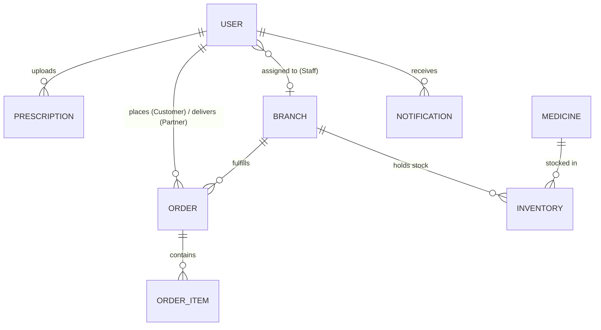
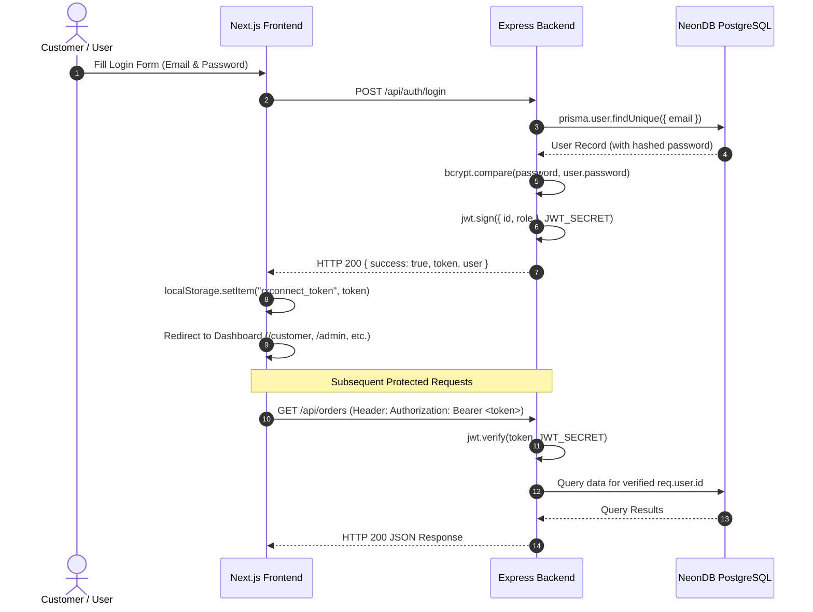

# RxConnect — Full-Stack Healthcare & Pharmacy Logistics Platform
## Comprehensive Project Documentation for Presentation & Viva

---

# Part 1 – Project Overview, Database Setup & Backend Setup (Member 1)

## 1. Project Overview
### Purpose of RxConnect
**RxConnect** is an end-to-end digital healthcare and smart pharmacy fulfillment web platform. It bridges the gap between healthcare consumers (patients/customers), licensed retail pharmacists, logistics delivery drivers, and pharmacy network administrators.

### Problem It Solves
In traditional pharmacy delivery workflows, three major problems exist:
1. **Prescription Compliance Risks**: Customers ordering prescription-only medicines (Rx) online often bypass medical validation. RxConnect enforces a **hard-gate verification workflow** where licensed pharmacists must inspect and approve doctor prescriptions before an order can be packed or fulfilled.
2. **Inventory Stockouts**: Retail pharmacy chains suffer from localized stockouts due to a lack of branch-level stock tracking. RxConnect tracks stock at individual pharmacy branches with minimum safety thresholds and low-stock alert triggers.
3. **Logistics Friction**: Standard courier services lack specialized medical dispatch tracking. RxConnect provides a dedicated Delivery Partner portal where drivers can view available pickup jobs, claim deliveries, and update real-time fulfillment statuses.

### User Roles & Responsibilities
RxConnect defines 4 strict Role-Based Access Control (RBAC) roles:
- **Customer (`CUSTOMER`)**: Browses medicines, uploads doctor prescriptions (via file upload or live WebRTC camera), manages shopping cart, places orders, and tracks delivery status.
- **Pharmacist (`PHARMACIST`)**: Verifies uploaded doctor prescriptions (approving or rejecting with reason), inspects branch inventory stock, and restocks low-inventory items.
- **Delivery Partner (`DELIVERY_PARTNER`)**: Claims available branch pickup jobs, manages active deliveries, toggles On-Duty/Off-Duty status, and updates fulfillment states to `OUT_FOR_DELIVERY` and `DELIVERED`.
- **Admin (`ADMIN`)**: Manages physical pharmacy branches, elevates user roles, monitors network-wide revenue/sales analytics, and adds new medicines to the global catalog.

---

## 2. Technology Stack

| Layer | Technology Used | Why It Was Chosen |
|---|---|---|
| **Frontend Framework** | **Next.js 15 (App Router)** | Provides fast server-side rendering (SSR), optimized static site generation (SSG), automatic file-system routing, and seamless client component hydrations. |
| **UI Rendering & Logic** | **React 19 & React Hooks** | Enables declarative UI state management using hooks (`useState`, `useEffect`, `useRef`), reactive re-rendering, and modular component composition. |
| **Styling System** | **Tailwind CSS & Modern Vanilla CSS** | Delivers ultra-responsive design, sleek dark/light themes, glassmorphism card styling, and micro-animations without external UI library bloat. |
| **Backend Runtime** | **Node.js** | Non-blocking, event-driven I/O JavaScript runtime ideal for high-concurrency REST APIs and asynchronous database queries. |
| **Backend Framework** | **Express.js v5** | Lightweight, fast web framework providing middleware chaining, routing controllers, and standardized HTTP response handling. |
| **Database ORM** | **Prisma ORM (v6)** | Type-safe database client with declarative schema modeling, auto-generated migrations, and prevention of SQL injection vulnerabilities. |
| **Database Server** | **PostgreSQL (NeonDB Cloud)** | Serverless, highly reliable relational database providing ACID compliance, relational foreign keys, composite indexes, and instant connection pooling over TLS. |
| **Authentication** | **JSON Web Tokens (JWT)** | Stateless, secure user authentication passing signed bearer tokens in HTTP authorization headers. |
| **Password Hashing** | **bcryptjs** | Industry-standard password hashing algorithm utilizing salt rounds to prevent rainbow table and brute-force attacks. |
| **File Upload Handling** | **Multer** | Multipart form-data handling middleware for saving uploaded prescription scans to local disk storage. |

---

## 3. Folder Structure & Key Files

```text
RxConnect/
├── backend/                        # Node.js + Express REST API Server
│   ├── config/
│   │   └── db.js                   # Prisma Client singleton initialization
│   ├── controllers/                # Business logic controllers
│   │   ├── adminController.js      # Branch analytics, user role updates, medicine creation
│   │   ├── authController.js       # Signup, login, JWT issuance, profile retrieval
│   │   ├── deliveryController.js   # Available jobs, job claiming, delivery status updates
│   │   ├── inventoryController.js  # Branch stock queries & restocking
│   │   ├── orderController.js      # Order creation, calculation, customer order retrieval
│   │   └── prescriptionController.js# Prescription uploads & pharmacist approvals
│   ├── middleware/                 # Express middleware functions
│   │   ├── authMiddleware.js       # Protects routes via JWT verification & role authorization
│   │   └── uploadMiddleware.js     # Multer file storage configuration for uploads
│   ├── prisma/
│   │   ├── schema.prisma           # Relational PostgreSQL database schema definition
│   │   └── seed.js                 # Seeding script populating branches, users, and stock
│   ├── routes/                     # REST API Endpoint routes
│   │   ├── adminRoutes.js          # /api/admin endpoints
│   │   ├── authRoutes.js           # /api/auth endpoints
│   │   ├── deliveryRoutes.js       # /api/delivery endpoints
│   │   ├── inventoryRoutes.js      # /api/inventory endpoints
│   │   ├── orderRoutes.js          # /api/orders endpoints
│   │   └── prescriptionRoutes.js   # /api/prescriptions endpoints
│   ├── .env                        # Environment variables (DATABASE_URL, JWT_SECRET, PORT)
│   └── server.js                   # Main Express application entry point
│
└── frontend/                       # Next.js 15 App Router Frontend Application
    ├── src/
    │   ├── app/                    # Next.js App Router Pages
    │   │   ├── page.js             # Public landing page with role select
    │   │   ├── admin/              # Admin control portal (/admin)
    │   │   ├── customer/           # Customer portal (/customer)
    │   │   ├── delivery/           # Delivery driver portal (/delivery)
    │   │   ├── pharmacist/         # Pharmacist verification portal (/pharmacist)
    │   │   ├── login/              # Multi-role authentication login pages
    │   │   ├── signup/             # Customer signup page
    │   │   ├── pharmacy-registration/ # Pharmacist & branch signup page
    │   │   └── delivery-registration/ # Delivery driver signup page
    │   └── components/             # Reusable UI React components
    │       ├── Header.js           # Navigation bar with live Notifications drawer & Logout
    │       ├── CartModal.js        # Customer cart slide-over modal
    │       ├── BrowseMedicinesView.js # Medicine catalog with search & category filters
    │       ├── OrdersView.js       # Customer order history & live delivery tracking
    │       ├── PrescriptionsView.js# Prescription upload view (File upload & WebRTC Camera)
    │       └── ProfileView.js      # User profile card & password update UI
    ├── package.json                # Dependencies & script configurations
    └── next.config.mjs             # Next.js 15 build configuration file
```

---

## 4. Database Setup (Prisma & NeonDB PostgreSQL)

### Why PostgreSQL & NeonDB?
PostgreSQL was chosen for its strict relational integrity, ACID compliance, and support for complex SQL aggregations. **NeonDB** provides a serverless PostgreSQL instance hosted in the cloud, accessible via secure connection strings with built-in connection pooling.

### Prisma Schema Models & Relationships



#### 1. `User` Model
Stores authenticated users for all 4 roles:
- `id` (String, Primary Key): Unique UUID/String ID.
- `fullName`, `email` (Unique), `phone`, `password` (Hashed via bcrypt).
- `role` (Enum): `CUSTOMER`, `PHARMACIST`, `DELIVERY_PARTNER`, `ADMIN`.
- `branchId` (Foreign Key -> `Branch.id`, Optional): Links pharmacists/staff to a branch.
- `employeeId`, `vehicle`, `isOnDuty` (Boolean): Role-specific metadata.

#### 2. `Branch` Model
Represents a physical pharmacy branch:
- `id` (String, PK), `code` (Unique String e.g. `BR-101`), `name`, `address`, `phone`.
- `fulfillmentRate` (Float): Percentage of orders fulfilled on time.
- `isOperational` (Boolean).

#### 3. `Medicine` Model
Represents global medication catalog items:
- `id` (String, PK), `name`, `category`, `price` (Float), `dosage`, `manufacturer`, `description`.
- `prescriptionRequired` (Boolean): Flag identifying Rx vs OTC medication.
- `imageUrl` (String).

#### 4. `Inventory` Model
Junction table tracking branch stock levels:
- `id` (PK), `medicineId` (FK -> `Medicine.id`), `branchId` (FK -> `Branch.id`).
- `quantity` (Int): Current units in stock.
- `threshold` (Int): Minimum safety threshold trigger for low-stock alerts.
- Constraint: `@@unique([medicineId, branchId])`.

#### 5. `Prescription` Model
Stores customer doctor prescription scans:
- `id` (PK), `userId` (FK -> `User.id`), `imageUrl`, `doctorName`, `notes`.
- `status` (Enum): `PENDING`, `APPROVED`, `REJECTED`.
- `rejectionReason` (String, Optional).

#### 6. `Order` & `OrderItem` Models
Represents customer purchases:
- `Order`: `id` (PK), `customerId` (FK -> `User.id`), `branchId` (FK -> `Branch.id`), `deliveryPartnerId` (FK -> `User.id`, Optional).
- `status` (Enum): `PLACED`, `VERIFIED`, `PACKED`, `OUT_FOR_DELIVERY`, `DELIVERED`, `REJECTED`, `CANCELLED`.
- `totalAmount` (Float), `paymentMethod`, `paymentStatus`.
- `OrderItem`: `id`, `orderId` (FK -> `Order.id`), `medicineName`, `quantity`, `price`, `isRx`.

#### 7. `Notification` Model
In-app alerts:
- `id` (PK), `userId` (Optional), `role` (Optional), `branchId` (Optional), `title`, `message`, `isRead` (Boolean).

---

## 5. Backend Server & Architecture

The Express server (`backend/server.js`) initializes CORS, JSON body parsers, static file serving for prescription uploads (`/uploads`), and mounts 6 route domains:
- `/api/auth` ➔ Authentication & user sessions
- `/api/medicines` ➔ Public medicine catalog queries
- `/api/orders` ➔ Customer order placement & history
- `/api/prescriptions` ➔ Prescription uploads & pharmacist queue
- `/api/delivery` ➔ Delivery driver job claiming & status tracking
- `/api/admin` ➔ Admin management & revenue analytics
- `/api/inventory` ➔ Branch inventory queries & restocking

---

# Part 2 – Customer Module (Member 2)

## Frontend Implementation (`/customer`)
The Customer Dashboard provides an intuitive multi-tab interface managed via React `useState`:
1. **Medicine Catalog**: Displays all OTC and Rx medicines fetched from `GET /api/medicines`. Features real-time search by medicine name and category tabs (Antibiotics, Pain Relief, Chronic Care, Vitamins).
2. **Shopping Cart & Checkout (`CartModal.js`)**:
   - Maintains cart state array `[{ id, name, price, quantity, isRx }]`.
   - Computes live subtotal and delivery fee (₹40 flat rate).
   - Validates whether any cart items require a prescription; if Rx items are present, verifies that the user has an `APPROVED` prescription.
   - Submits payload to `POST /api/orders`.
3. **Prescription Upload (`PrescriptionsView.js`)**:
   - Supports two upload mechanisms: standard file picker or **Live WebRTC Camera Stream** capturing snapshot via HTML5 Canvas.
   - Posts multipart form data to `POST /api/prescriptions/upload`.
4. **Orders & Delivery Tracking (`OrdersView.js`)**:
   - Fetches customer orders from `GET /api/orders`.
   - Displays real-time progress steps (`PLACED` ➔ `VERIFIED` ➔ `PACKED` ➔ `OUT_FOR_DELIVERY` ➔ `DELIVERED`).

## Backend API Handlers
- `POST /api/auth/signup`: Validates input, hashes password using `bcrypt.hash(password, 10)`, creates `User` with role `CUSTOMER`, and returns JWT token.
- `POST /api/orders`: Receives order items, validates branch assignment, calculates total price, creates `Order` and `OrderItem` records in Prisma, and emits an in-app notification to Customer and Pharmacist.
- `POST /api/prescriptions/upload`: Processes image upload via Multer, saves record in `Prescription` table with status `PENDING`, and triggers notification for Pharmacists.

---

# Part 3 – Pharmacist Module (Member 3)

## Frontend Implementation (`/pharmacist`)
The Pharmacist Verification Portal provides licensed pharmacists with hard-gate verification tools:
1. **Prescription Verification Queue**:
   - Lists all `PENDING` doctor prescriptions.
   - Pharmacists inspect high-resolution prescription images, doctor names, and patient notes.
   - Pharmacists click **Approve & Verify** (updates status to `APPROVED`) or **Reject Prescription** (opens modal to enter rejection reason).
2. **Branch Stock & Low Stock Thresholds**:
   - Lists all inventory items for the pharmacist's branch.
   - Highlights items falling below minimum safety threshold (`stock < threshold`) with red alerts.
   - Provides a **+ Restock 20** action button that dispatches a REST POST request to update database inventory.

## Backend Implementation
- `GET /api/prescriptions`: Fetches pending prescriptions filtered for verification.
- `PATCH /api/prescriptions/:id/status`: Updates prescription status in Prisma DB to `APPROVED` or `REJECTED`. Creates a notification for the customer.
- `POST /api/inventory/restock`: Finds the target `Inventory` record by `medicineId` and `branchId`, executing `prisma.inventory.update({ data: { quantity: { increment: amount } } })`.

---

# Part 4 – Admin & Delivery Partner Modules (Member 4)

## Admin Portal (`/admin`)
1. **Dashboard Overview**: Displays network-wide metrics (active branches, total users, pending orders, revenue totals).
2. **Medicine Catalog Management (`MedicineManagementView.js`)**:
   - Lists all catalog items with real-time search and category filtering.
   - Modal form allows Admin to add new medicines (Name, Category, Price INR, Dosage, Manufacturer, Rx requirement) into the `Medicine` table and automatically allocate initial branch `Inventory`.
3. **User Management**: Allows Admin to view all registered users and elevate/change roles (e.g. `CUSTOMER` ➔ `PHARMACIST` or `DELIVERY_PARTNER`).
4. **Sales & Analytics (`AnalyticsView.js`)**: Computes real-time gross revenue in INR (₹), Rx vs. OTC order ratio, top 5 selling medicines, and monthly revenue trends.

## Delivery Partner Portal (`/delivery`)
1. **Available Jobs Queue**: Displays ready-for-pickup orders (`PLACED`, `VERIFIED`, `PACKED`) assigned to the driver's branch. Drivers click **Claim Order** to lock the job.
2. **Active Deliveries**: Displays claimed orders with customer address and phone number. Drivers click **Mark Out for Delivery** and **Mark Delivered**.
3. **Driver Duty Toggle**: Switch to toggle `On Duty` / `Off Duty` status.
4. **Delivery History & Earnings**: Displays completed deliveries and total earnings in INR.

---

# State Management (Entire Project Analysis)

### What is State Management & Why is it Required?
State management is the mechanism used to store, update, and sync dynamic data (e.g. user logins, shopping carts, order status updates) across UI components and backend databases.

### Approach Used
RxConnect utilizes a **Lightweight 3-Tier State Management System** without third-party state libraries like Redux or Zustand:
1. **Database State (NeonDB PostgreSQL)**: Central persistent source of truth.
2. **Backend Runtime State (Node.js & Express)**: Handles JWT sessions, role authorizations, and transactional database mutations.
3. **Frontend Local Component State (React Hooks + `localStorage`)**:
   - `useState`: Manages tab switches, modal visibilities, form inputs, cart items, and loaded API arrays.
   - `useEffect`: Triggers asynchronous `fetch()` calls on component mount to synchronize frontend UI state with database state.
   - `localStorage`: Persists session JWT tokens (`rxconnect_token`) and user profiles (`rxconnect_user`) across page refreshes.

---

# Authentication Flow



---

# Complete End-to-End API Execution Flow

```text
[User Action: Click "+ Restock 20" in Pharmacist Portal]
       │
       ▼
1. Frontend React Component (pharmacist/page.js)
   Calls handleRestockItem(medicineId)
       │
       ▼
2. Fetch API Request
   POST http://localhost:5001/api/inventory/restock
   Header: Authorization: Bearer <JWT_TOKEN>
   Body: { medicineId: "med-101", amount: 20 }
       │
       ▼
3. Express Router (backend/routes/inventoryRoutes.js)
   Matches POST /restock
       │
       ▼
4. Auth Middleware (backend/middleware/authMiddleware.js)
   jwt.verify() validates token signature & extracts req.user
   authorize("PHARMACIST", "ADMIN") checks role permission
       │
       ▼
5. Controller Handler (backend/controllers/inventoryController.js)
   Executes restockInventory(req, res)
       │
       ▼
6. Prisma ORM Query (backend/config/db.js)
   prisma.inventory.update({
     where: { medicineId_branchId: { medicineId, branchId } },
     data: { quantity: { increment: 20 } }
   })
       │
       ▼
7. NeonDB PostgreSQL Database
   Executes SQL UPDATE statement & commits transaction
       │
       ▼
8. JSON Response Sent to Client
   HTTP 200 OK { success: true, message: "Inventory restocked by 20 units" }
       │
       ▼
9. React State Update
   setInventory(updatedArray) -> UI automatically re-renders new stock number
```

---

# Conclusion

RxConnect demonstrates a modern, scalable full-stack web application architecture designed for critical healthcare logistics. By combining **Next.js 15 App Router**, **Express.js v5**, **Prisma ORM**, and **NeonDB PostgreSQL**, the platform achieves:
- Strict hard-gate prescription compliance.
- Real-time inventory tracking and low-stock alerts.
- Dedicated role-based portals for Customers, Pharmacists, Delivery Partners, and Administrators.
- 100% pure database persistence with zero reliance on static mock data.
